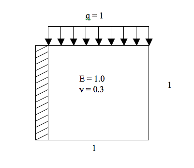

# Metodos dos Elementos Finitos 1

Esse repositório contempla os códigos utilizados na disciplina COC752 da COPPE/UFRJ que aborda o Método dos Elementos Finitos. A disponibilização do código aqui presente tem o objetivo de facilitar futuras consultas nessa área, assim como auxiliar futuros estudantes da disciplina.

## Trabalho

A disciplina de Métodos dos Elementos Finitos 1 possui um trabalho que deve ser desenvolvido ao longo do curso. Um exemplo é fornecido, mas o trabalho se divide em algumas partes:

### Geração de malhas

O professor sugere que algumas malhas sejam desenvolvidas para a realização do trabalho. Essas malhas podem variar de 16x16 até 512x512 elementos. Os elementos incluem triângulos e quadriláteros. Para entender o formato de entrada do programa, verifique [clique aqui](FORMATO.md).

Essa parte do trabalho não precisa ser realizada necessariamente em Fortran, existem precedentes em Python e usando o Excel. O importante é entender a lógica de como a malha é gerada para os quadriláteros e depois como é feita a divisão do quadrilátero em 2 elementos triangulares.

Um exemplo de implementação em Fortran está disponível na pasta [gerador_malhas](gerador_malhas). Um exemplo em Python apenas para quadriláteros feito pelo ex-aluno Fabio Cesar Canesin está disponível [aqui](https://github.com/canesin/MEF/blob/master/malhas_trabalho/quadradounitario.py).

### Resultados no Paraview

O programa fornecido não suporta o visualizador Paraview. A segunda parte consiste em adaptar o programa para que sua saída seja convertida no formato compatível com o visualizador. Uma alternativa é fazer um conversor entre os formatos.

### Inclusão do elemento quadrilátero bilinear

O programa fornecido não suporta o elemento quadrilátero bilinear. A terceira parte consiste na inclusão desse elemento.

### Inclusão do método do gradiente conjugado

### Coleta dos resultados.