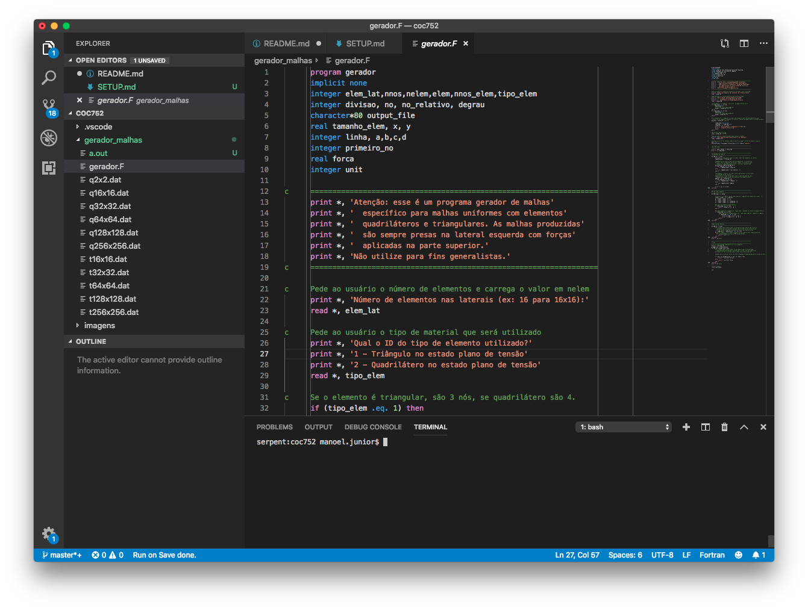

# Como começar?

## Preparando o ambiente de programação

### Editor de textos

Para começar, instale o Visual Studio Code. Embora o editor de texto seja uma escolha pessoal, os exemplos nesse repositório foram feitos usando ele. Você pode encontrar instruções detalhadas de como instalar ele em: https://code.visualstudio.com/.

Os códigos nesse repositório estão formatados utilizando esse editor, logo você deverá ter uma interface semelhante a mostrada na imagem a seguir.

### Compilador Fortran

Após a instalação do editor de texto, você pode instalar algumas extensões usando seu Marketplace interno. Os códigos nesse repositório utilizaram:
- Modern Fortran
- Disassembly Explorer

Finalmente, você deve instalar o `g77` no seu computador. Os exemplos nesse repositórios foram executados em um MacOS e os binários estavam disponíveis em http://hpc.sourceforge.net/. A versão do `gfortran` disponível no [brew](https://brew.sh) foi feita para o Fortran95 e também é compatível. Na pasta `vendor` desse repositório os binários estão disponíveis também.

Se você não souber instalar o `g77`, use o `gfortran` que não terá problemas.